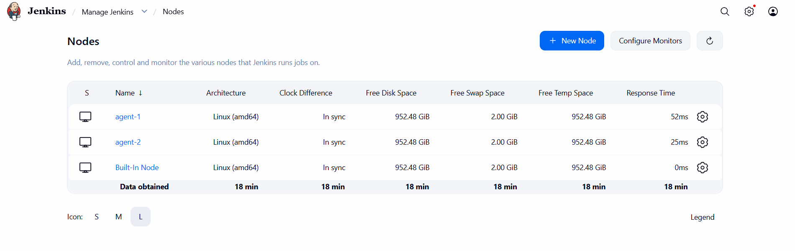
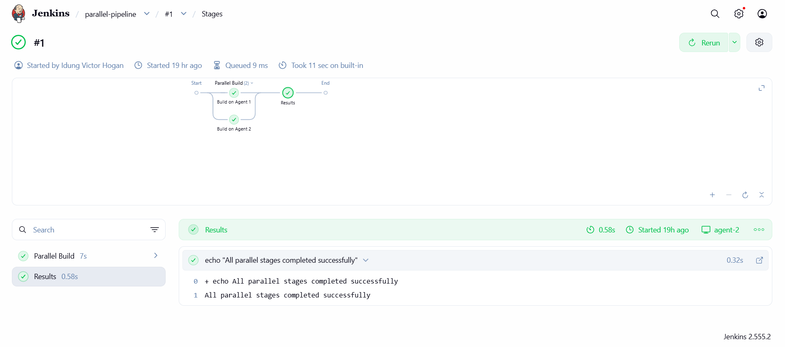
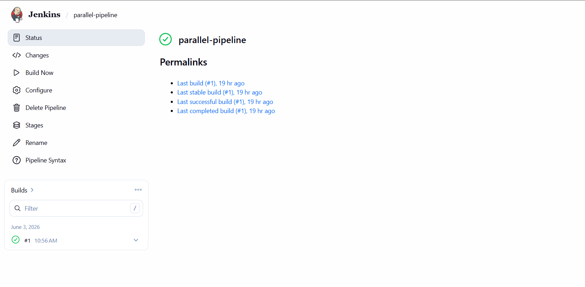

# 🔧 Jenkins Remoting Project

> **Code Alpha Internship — Task 2**
> A fully distributed Jenkins CI/CD environment built with Docker on Windows, demonstrating remote node connection, parallel build distribution, and security hardening using Jenkins Remoting.

---

## 📋 Table of Contents

- [Project Overview](#-project-overview)
- [Objectives](#-objectives)
- [Architecture](#-architecture)
- [Tech Stack](#-tech-stack)
- [Project Structure](#-project-structure)
- [Getting Started](#-getting-started)
  - [Prerequisites](#prerequisites)
  - [Setup](#setup)
- [Phases](#-phases)
  - [Phase 1 — Environment Setup](#phase-1--environment-setup)
  - [Phase 2 — Connect Remote Nodes](#phase-2--connect-remote-nodes)
  - [Phase 3 — Distribute Build Loads](#phase-3--distribute-build-loads)
  - [Phase 4 — Security & Node Isolation](#phase-4--security--node-isolation)
  - [Phase 5 — Cross-Architecture Testing](#phase-5--cross-architecture-testing)
- [Pipelines](#-pipelines)
- [Results](#-results)
- [Challenges & Solutions](#-challenges--solutions)
- [Lessons Learned](#-lessons-learned)
- [Screenshots](#-screenshots)
- [References](#-references)

---

## 📌 Project Overview

This project demonstrates how **Jenkins Remoting** works in a real-world distributed CI/CD setup. Instead of running all builds on a single Jenkins master, build jobs are distributed across multiple remote agent nodes — each running independently and reporting results back to the master in real time.

The entire infrastructure is simulated locally on a **Windows machine using Docker Desktop**, where each container acts as a separate remote machine. This approach mirrors how production Jenkins environments are structured in enterprise DevOps pipelines.

---

## 🎯 Objectives

- ✅ Set up Jenkins Remoting to connect remote Jenkins nodes
- ✅ Distribute build loads across different machines securely
- ✅ Run jobs on various node configurations remotely
- ✅ Improve security using node isolation
- ✅ Gain hands-on experience with Jenkins' remote execution capabilities

---

## 🏗 Architecture

```
┌─────────────────────────────────────────────────────┐
│               Docker Network: jenkins                │
│                                                      │
│   ┌──────────────────────┐                           │
│   │    Jenkins Master    │  ← Port 8080 (Web UI)     │
│   │     (controller)     │  ← Port 50000 (Agents)    │
│   └──────────┬───────────┘                           │
│              │  Jenkins Remoting (JNLP4 / TCP)       │
│       ┌──────┴──────┐                                │
│       │             │                                │
│  ┌────┴─────┐  ┌────┴─────┐                          │
│  │ Agent 1  │  │ Agent 2  │                          │
│  │  linux   │  │  linux   │                          │
│  │ (tier-1) │  │ (tier-2) │                          │
│  └──────────┘  └──────────┘                          │
└─────────────────────────────────────────────────────┘
```

**How it works:**
- The **Jenkins Master** runs the web UI, schedules jobs, and manages the build queue
- **Agents** connect to the master via the Jenkins Remoting protocol over TCP port 50000
- When a job is triggered, the master delegates execution to an available agent based on **node labels**
- The agent runs the job and streams logs/results back to the master in real time
- The master never executes build jobs directly (0 executors)

---

## 🛠 Tech Stack

| Tool | Purpose |
|------|---------|
| **Jenkins LTS** | CI/CD master controller |
| **Docker Desktop** | Container runtime on Windows |
| **jenkins/inbound-agent** | Official Jenkins agent Docker image |
| **Jenkins Remoting (JNLP4)** | Agent-to-master communication protocol |
| **Declarative Pipeline (Groovy)** | Pipeline-as-code for build jobs |
| **PowerShell** | CLI for container and environment management |
| **Docker Bridge Network** | Isolated private network for all containers |

---

## 📁 Project Structure

```
jenkins-remoting-project/
│
├── README.md                        ← You are here
│
├── docs/
│   └── jenkins-remoting-project.md ← Full step-by-step project documentation
│
├── pipelines/
│   ├── parallel-pipeline.groovy    ← Parallel build across two agents
│   ├── test-agent-job.groovy       ← Basic agent targeting job
│   └── cross-arch-pipeline.groovy  ← Multi-stage cross-architecture pipeline
│
├── docker/
│   └── setup.md                    ← All Docker commands reference
│
└── screenshots/
    ├── nodes-online.png             ← Both agents online in Jenkins
    ├── parallel-build.png           ← Parallel stages running simultaneously
    └── build-success.png            ← Successful distributed build
```

---

## 🚀 Getting Started

### Prerequisites

- Windows 10/11
- [Docker Desktop](https://www.docker.com/products/docker-desktop/) installed and running
- At least 4GB RAM allocated to Docker
- Internet connection (for pulling images)

### Setup

**1. Create the Docker network**
```powershell
docker network create jenkins
```

**2. Run the Jenkins Master**
```powershell
docker run -d `
  --name jenkins-master `
  --network jenkins `
  -p 8080:8080 `
  -p 50000:50000 `
  -v jenkins_home:/var/jenkins_home `
  jenkins/jenkins:lts
```

**3. Get the initial admin password**
```powershell
docker exec jenkins-master cat /var/jenkins_home/secrets/initialAdminPassword
```

**4. Complete setup at** `http://localhost:8080`

**5. Register agents in Jenkins UI**

Go to **Manage Jenkins → Nodes → New Node** and create `agent-1` and `agent-2` with:
- Launch method: `Launch agent by connecting it to the controller`
- Labels: `linux`
- Remote root: `/home/jenkins/agent`

**6. Launch agent containers** (replace `<SECRET>` with token from Jenkins UI)
```powershell
docker run -d `
  --name jenkins-agent-1 `
  --network jenkins `
  jenkins/inbound-agent `
  -url http://jenkins-master:8080 `
  -secret <SECRET_FOR_AGENT_1> `
  -name agent-1 `
  -workDir /home/jenkins/agent

docker run -d `
  --name jenkins-agent-2 `
  --network jenkins `
  jenkins/inbound-agent `
  -url http://jenkins-master:8080 `
  -secret <SECRET_FOR_AGENT_2> `
  -name agent-2 `
  -workDir /home/jenkins/agent
```

**7. Verify all containers are running**
```powershell
docker ps
```

---

## 📦 Phases

### Phase 1 — Environment Setup
- Installed Jenkins LTS via Docker
- Created an isolated Docker bridge network named `jenkins`
- Configured Jenkins through the web setup wizard
- Verified master is accessible at `http://localhost:8080`

### Phase 2 — Connect Remote Nodes
- Registered `agent-1` and `agent-2` as permanent agents in Jenkins
- Launched agent containers using the `jenkins/inbound-agent` image
- Connected agents to master via JNLP4 protocol over TCP port 50000
- Verified both agents show online status in **Manage Jenkins → Nodes**

### Phase 3 — Distribute Build Loads
- Created node labels (`linux`, `tier-1`, `tier-2`) for job routing
- Built a Declarative Pipeline with parallel stages running on separate agents
- Confirmed load distribution via Stage View and build console output
- Monitored real-time resource usage with `docker stats`

### Phase 4 — Security & Node Isolation
- Enabled Agent-to-Master Access Control in Jenkins security settings
- Set master executor count to `0` — master coordinates only, never builds
- Applied tier labels to restrict which jobs run on which agents
- Documented network isolation considerations for production hardening

### Phase 5 — Cross-Architecture Testing
- Built a multi-stage pipeline simulating checkout → test → package → report
- Ran parallel unit and integration test stages on separate agents
- Tested agent failover by stopping a container and observing Jenkins rescheduling
- Verified agents reconnect automatically after restart

---

## 🔁 Pipelines

### Parallel Pipeline
Runs two build stages simultaneously across both agents:
```groovy
pipeline {
    agent none
    stages {
        stage('Parallel Build') {
            parallel {
                stage('Agent 1') {
                    agent { label 'linux' }
                    steps { sh 'echo "Running on $NODE_NAME"' }
                }
                stage('Agent 2') {
                    agent { label 'linux' }
                    steps { sh 'echo "Running on $NODE_NAME"' }
                }
            }
        }
    }
}
```
See full script: [`pipelines/parallel-pipeline.groovy`](pipelines/parallel-pipeline.groovy)

---

## ✅ Results

| Objective | Status |
|-----------|--------|
| Jenkins master running | ✅ Complete |
| Remote agents connected via JNLP | ✅ Complete |
| Parallel builds distributed across agents | ✅ Complete |
| Master restricted to 0 executors | ✅ Complete |
| Node labels for job routing | ✅ Complete |
| Agent failover tested | ✅ Complete |
| Full project documented | ✅ Complete |

---

## 🧩 Challenges & Solutions

| Challenge | Solution |
|-----------|----------|
| `ping` not available in agent container | Used `curl` to test connectivity; noted that minimal images exclude non-essential tools by design |
| `Unknown client name` error on agent connect | Deleted and recreated the node in Jenkins UI to generate a fresh secret token |
| Container name conflict on re-run | Used `docker rm -f <name>` before re-running containers |
| Jobs queued but not running | Added `linux` label to agents and matched it in pipeline's `agent { label }` |
| Master running jobs instead of agents | Set Built-In Node executor count to `0` |

---

## 💡 Lessons Learned

- **Jenkins Remoting is a persistent TCP protocol**, not HTTP — understanding this explains why port 50000 must be exposed separately from the web UI port
- **Labels decouple pipelines from infrastructure** — using `agent { label 'linux' }` instead of hardcoded agent names means pipelines don't break when you rename or replace nodes
- **The master should never run jobs** — this is a Jenkins best practice; setting executors to 0 enforces a clean separation between coordination and execution
- **Docker makes distributed CI/CD accessible** — what normally requires multiple physical machines can be fully simulated on a single developer laptop with containers
- **Minimal Docker images require creative debugging** — tools like `ping` and `curl` are absent by design; knowing what's available in the image is part of working with containers professionally
- **Secret tokens are per-node and single-use** — once a token is consumed by a failed connection attempt, recreating the node generates a fresh valid token

---

## 📸 Screenshots

| Description | File |
|-------------|------|
| Both agents online in Jenkins | `screenshots/nodes-online.png` |
| Parallel pipeline stage view | `screenshots/parallel-build.png` |
| Successful distributed build | `screenshots/build-success.png` |

---

## 👤 Author

**Idung Victor**
Code Alpha Internship — DevOps Track
[Your GitHub Profile](https://github.com/yourusername)

---

*This project was completed as part of the Code Alpha internship program.*